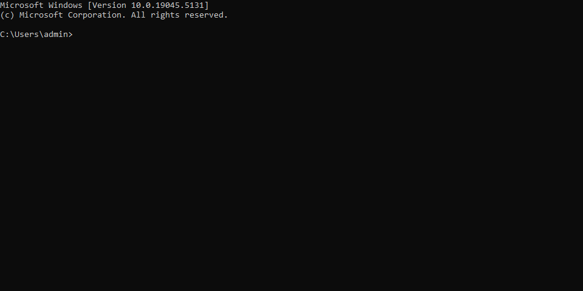

# Commander
A lightweight Go tool to retrieve information about the host system.

## Build
### Go binary
1. Ensure that you are in the base directory of this repo
2. The environment variable `GOOS` must be set to "windows"
    1. Note: This can be done inline with a prefix to the `go` command
3. Run `go build -o windowscommander.exe`

### Windows installer
To build the Windows installer, the `makensis` command must be available. It can be installed by following this link https://nsis.sourceforge.io/Download 

1. Ensure that you are in the base directory of this repo
2. Build the Go binary, following the steps [above](#go-binary)
3. Run `makensis .\installer.nsi`
4. A new file `commander.exe` would be generated. This is the installer file.

## API
### Get System Info
#### Request
`POST /execute`

    curl -XPOST http://localhost:8080/execute \
        --header "Content-Type: application/x-www-form-urlencoded" \
        --data-urlencode "command=get-system-info"

### Response

    {
        "Hostname": "MY-DESKTOP",
        "IPAddress": "192.168.0.34"
    }

### Ping a given host
#### Request
`POST /execute`

    curl -XPOST http://localhost:8080/execute \
        --header "Content-Type: application/x-www-form-urlencoded" \
        --data-urlencode "command=ping" \
        --data-urlencode "host=google.com"

### Response

    {
        "Successful": true,
        "Time": 10000000
    }

## Installation
The installer executable `commander.exe` can be run on any modern Windows computer. Upon opening the installer, the user will be presented with request for admin permissions, which are required for proper execution.

After install, files will be placed in the Program Files directory (in most cases `C:\Program Files (x86)\Commander`). Also, the application will start-up with Windows automatically.

Note: In some cases, antivirus software will block the application so you will need to follow the instructions for your specific antivirus software to unblock it.

## Testing
Go unit tests have been created for the `commander` package. These include positive and negative use cases, as much as possible.

To run all tests: `go test ./...`

## Example
